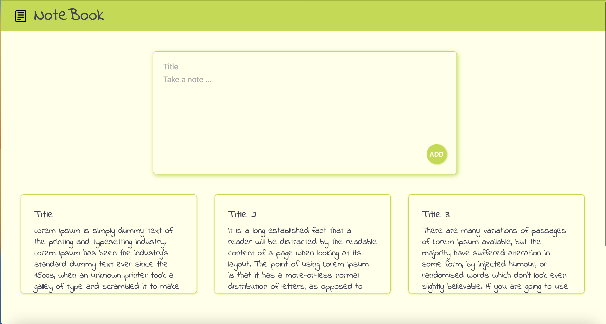
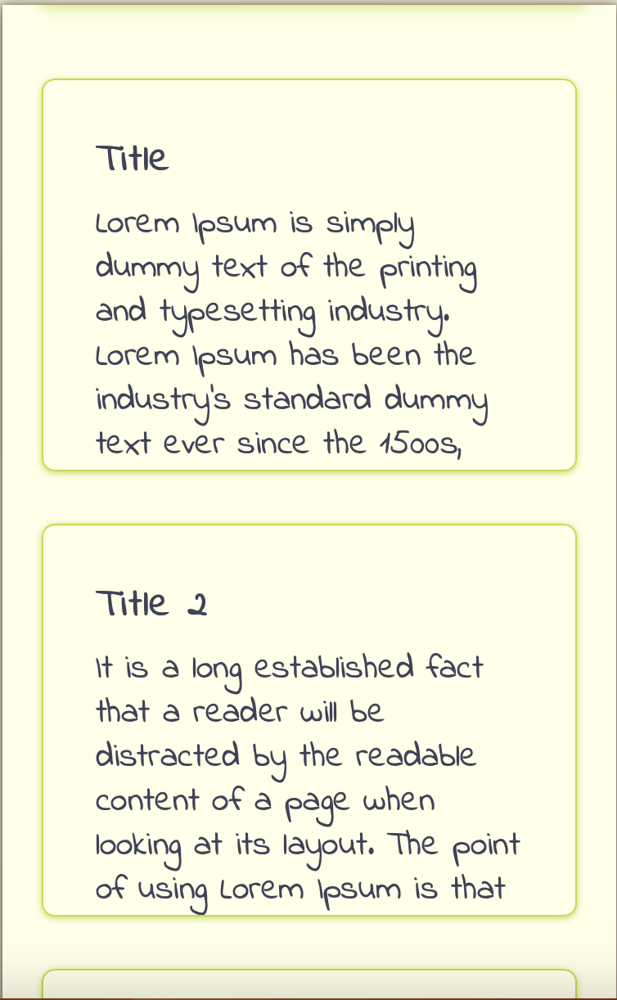

# NoteBook

NoteBook is a simple website where you can take digital notes.

## Overview

### Features

#### Layout

- Header with logo and title
- Main page
- Footer with my social media links, my name and the current year

#### Pages and components

- One-page website
- Initially loaded the page displaying a form with inputs for the title and the content
- Below the form is position the list with the taken notes

### Screenshots







### Links

[Live site](https://notebook-rouge.vercel.app) </br>
[Source code](https://github.com/NDraganov/notebook)

## Development

### Built with

- Next.js
- CSS using the grid and the flex
- React icons

### What I've learned

With this project, I learn how to programmatically add props

```js
const handleClick = () => {
  props.onDelete(props.id);
};
```

And how to filter object from an array and remove it from it

```js
const deleteNote = (id) => {
  setNotes((allNotes) => {
    return allNotes.filter((note, index) => {
      return index !== id;
    });
  });
};
```

## Deployment

- I create new Next.js project using "create-next-app" in Hyper Terminal
- Then I create new GitHub repository
- Then I connect local to remote repository
  - git init
  - git add.
  - git commit -m "message"
  - git remote add origin "URL"
  - git push -u origin master
- I used the default "npm run build" command to optimize the project for production
- Then I used "npm run start" to expect the production version
- I used the Vercel platform for publishing my project
